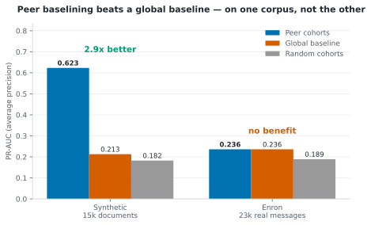
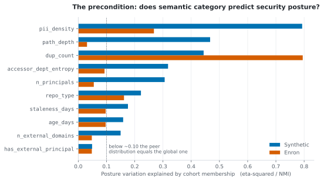
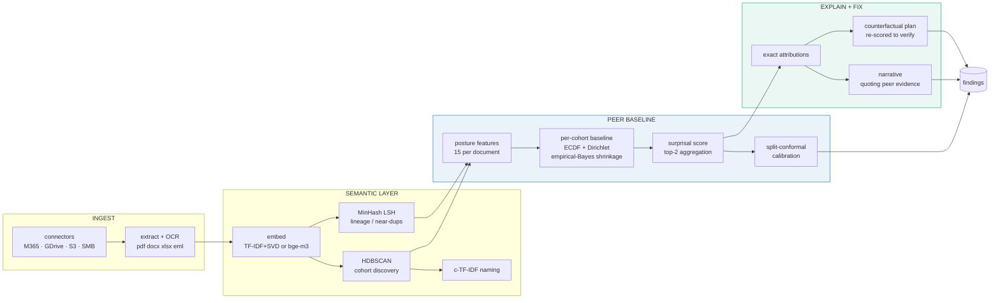
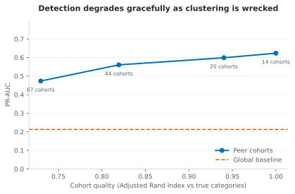

# Cohort

**Peer-baseline anomaly detection for unstructured enterprise data.** Discover what
documents *mean*, learn what normal security posture looks like for each kind, then
flag the files whose permissions don't match their peers — with an exact explanation
and a verified fix.

No rules. No regex. No end-user labelling. Nothing supervised anywhere in the pipeline.

```bash
pip install -e . && cohort demo
```

> **Attribution.** Peer-baseline risk analysis is a concept published by Concentric AI
> as Risk Distance™. This is an independent reimplementation built from their public
> descriptions of the idea — no proprietary code, data, or internal detail was used or
> is claimed. Not affiliated with or endorsed by Concentric AI. The trademark belongs
> to them; the implementation, benchmark, and results here are mine.

---

## The short version: it works, and I found where it doesn't

The method's central claim is that judging a document against *semantically similar
peers* beats judging it against the corpus as a whole. Measured on two corpora, that
claim holds decisively in one and **fails completely** in the other:

| Corpus | Peer cohorts | Global baseline | |
|---|---:|---:|---|
| **Synthetic** — 15k documents, injected anomalies | **0.623** | 0.213 | **2.9× better** |
| **Enron** — 23k real messages, injected anomalies | **0.236** | 0.236 | **no benefit at all** |

<sub>PR-AUC (average precision). Both corpora carry the same ~2% anomaly rate.</sub>

<picture>
  <source media="(prefers-color-scheme: dark)" srcset="docs/assets/peer-vs-global-dark.svg">
  
</picture>

The gap is not noise and it is not a bug. Peer baselining only pays off when
documents that *mean* the same thing are also *handled* the same way — and that
coupling is structural in a document repository (contracts go to legal, offer letters
to HR, each with its own sharing norm) and almost absent in email, where how many
people you copy has more to do with the moment than the topic.

So I built a metric for it. `posture_coupling` measures how much posture variation
cohort membership actually explains — and it separates the two cases cleanly, on the
features that matter:

<picture>
  <source media="(prefers-color-scheme: dark)" srcset="docs/assets/coupling-dark.svg">
  
</picture>

On the features the injected anomalies actually perturb — `n_principals` 0.306 vs
**0.055**, `accessor_dept_entropy` 0.318 vs **0.093**, `n_external_domains` 0.150 vs
**0.048** — Enron collapses to near zero.

<sub>`dup_count` is the one feature where Enron scores higher, and it is circular
rather than signal: forwarded copies of the same mail cluster together
semantically, so cohort membership trivially predicts duplicate count.</sub>

**Run `posture_coupling` on your corpus before deploying this.** Near 0.05 means the
peer distribution equals the global one, peer-relative scoring has nothing to be
relative *to*, and the method will not pay for its complexity.

That is the useful result. [Full real-corpus findings ↓](#real-corpus-results) ·
[ADR 0006](docs/adr/0006-real-corpus-validation.md)

---

## Synthetic benchmark, in detail

15,000-document synthetic enterprise, 314 injected posture anomalies (2.09% base
rate), 14 cohorts discovered without supervision. Seed 1337, reproducible from a
clean checkout with `make baseline`.

| Metric | Value |
|---|---|
| **PR-AUC** (average precision) | **0.623** |
| ROC-AUC | 0.969 |
| **Precision@50** | **1.000** |
| Precision@100 | 0.800 |
| Precision@300 | 0.620 |
| Recall@300 | 0.592 |
| Flag rate at conformal α=0.05 | 4.01% |
| Recall among flagged | 0.752 |

The ablation that carries the claim:

| Baseline strategy | PR-AUC | |
|---|---:|---|
| **Peer cohorts** (semantic) | **0.623** | |
| Random cohorts, same sizes | 0.182 | **3.4× worse** |
| One global baseline | 0.213 | **2.9× worse** |

The random-cohort control is the important half. Bucketing documents at all is not
what helps — bucketing them *by meaning* is. Without that control, the number would
be consistent with a plain bucketing artefact.

Across three independent corpus seeds: **PR-AUC 0.623 / 0.534 / 0.561**.

### Per anomaly type

| Anomaly type | n | PR-AUC | Recall@300 | Recall at threshold |
|---|---:|---:|---:|---:|
| `wrong_location` (file in a personal drive) | 63 | 0.662 | 0.857 | 0.968 |
| `stale_external_access` (dormant partner grant) | 54 | 0.516 | 0.722 | 0.815 |
| `overshared_principal_count` (all-company grant) | 48 | 0.463 | 0.792 | 0.854 |
| `third_party_access` (unrelated partner added) | 65 | 0.191 | 0.369 | 0.446 |
| `external_link_on_sensitive` (anyone-with-link) | 52 | 0.141 | 0.442 | 0.885 |
| `mislabeled_down` (sensitivity downgraded) | 32 | 0.045 | 0.250 | 0.469 |

The bottom two rows are a real, understood weakness rather than noise — see
[Where this is weak](#where-this-is-weak).

### Cohort discovery, unsupervised

| Metric | Value |
|---|---|
| Cohorts discovered | 14 |
| Adjusted Rand Index vs. true categories | 1.000 |
| Homogeneity / Completeness | 1.000 / 1.000 |
| Silhouette (cosine) | 0.640 |
| Unassigned | 1.23% |

ARI of 1.000 is **not** a claim about real documents — see
[Honest limitations](#honest-limitations-of-the-benchmark). The 1.23% unassigned turned out to be
exactly the German and French contracts, which the offline TF-IDF backend cannot
group with their English equivalents. That is a correct refusal, not a failure.

### Throughput

| Stage | Rate |
|---|---|
| Embedding (TF-IDF → SVD, CPU) | ~1,250 docs/s |
| Scoring against fitted baselines | ~14,000 docs/s |
| End-to-end scan | ~660 docs/s |

Single CPU core, no GPU, no model downloads. A 15k-document scan takes ~23 seconds.

---

## What a finding actually looks like

Real output, copied from `cohort show doc-005089`:

```
DOC:   doc-005089 | MSA Corvid Analytics v560
COHORT: Customer / Liability / Services    risk 12.58 nats    conformal p 0.0075

WHY  Compared with 1251 peer documents in 'Customer / Liability / Services',
     it is stored in onedrive_personal — no other document in this cohort of
     1251 does. In addition, it sits at path depth 2 (fewer than 1% of 1251
     peers are this far from the norm, median is 5.00). In addition, it carries
     the restricted sensitivity label (only 67 of 1251 peers do, and most use
     'confidential'). Risk 12.6 nats; 48% of that comes from repo_type.

FIX  Relocate document: onedrive_personal -> sharepoint (-4.86 nats);
     Reapply sensitivity label: restricted -> confidential (-1.06 nats);
     Restrict sharing link scope: internal_link -> none (-0.49 nats).
     Residual risk 6.18 nats — resolves the finding.

GROUND TRUTH  wrong_location, injected into vendor_msa   ✓
```

Two things about that output are load-bearing:

- **The explanation is the model, not a story about the model.** "48% comes from
  `repo_type`" is arithmetic. The score is a sum of per-feature surprisals and the
  attribution is the term that was added. There is no SHAP, no surrogate, no
  sampling noise. A test asserts the identity to floating-point tolerance.
- **The fix is verified, not predicted.** Each proposed plan is re-scored through
  the same engine that raised the finding, so "residual risk 6.18" is a measurement.

---

## How it works



Every stage is unsupervised. No category list, no labelled examples, no regex — the
only place a rule appears is entity *extraction* (counting identifiers inside a
document), never classification of what a document is.

**1. Cohorts, not categories.** Documents are embedded and clustered with HDBSCAN.
No category list exists anywhere in the code — a customer with a document type
nobody anticipated still gets a cohort for it. Clustering runs on a reduced 40-d
view because density-based methods lose contrast as dimensionality grows.

**2. A baseline per cohort.** For every cohort, learn the distribution of fifteen
posture features: link scope, repository type, sensitivity label, ACL origin,
principal count after group expansion, external domains, departmental spread of the
audience, path depth, age, dormancy, PII density, duplicate count.

**3. Score by surprisal.** For document *d* in cohort *c*:

$$S(d) = \sum_{j \in \text{top-}k} s_j(d), \qquad s_j(d) = \max\big(0,\ -\log \tilde p_j(d) - \bar s_j(c)\big)$$

- *Categorical* features use Dirichlet-smoothed probabilities; $\bar s_j$ is the
  cohort's entropy — the exact expected surprisal — so a typical value contributes zero.
- *Continuous* features use the **empirical tail probability** within the cohort,
  not a fitted Gaussian. This was changed after measurement, not before: see
  [ADR 0002](docs/adr/0002-ecdf-not-location-scale.md).
- Both shrink toward the corpus-wide baseline by empirical Bayes with weight
  $w_c = n_c/(n_c+\kappa)$, so a nine-document cohort cannot declare its own
  accidents to be normal.
- Only the **top-2** surprisals are summed. An anomaly is a document extreme on a
  couple of dimensions, not one mildly odd across all fifteen
  ([ADR 0003](docs/adr/0003-topk-aggregation.md)).

**4. Calibrate.** Split-conformal turns the raw score into a p-value, so a threshold
means "≈5% false positive rate" rather than "4.7 nats". The calibration set is
contaminated by the same 2% anomaly rate as everything else, which makes the
guarantee approximate and mildly conservative — stated, and measured, rather than
assumed away.

**5. Explain and fix.** Exact attributions → templated narrative quoting the peer
evidence → greedy minimum-cost counterfactual, re-scored to verify.

---

## Real-corpus results

Everything above is generated data. Two public corpora were used to check what
survives contact with real documents. Run them yourself:

```bash
pip install -e '.[real]' && cohort real-eval --config configs/real.yaml
```

### Cohort discovery collapses on real text — 20 Newsgroups

8,815 real Usenet posts, 20 gold labels, headers and quoted replies stripped.

| Configuration | cohorts | unassigned | **ARI** |
|---|---:|---:|---:|
| SVD + fixed 0.55 bar — *the v1.0 default* | 3 | **85.0%** | **0.129** |
| UMAP + fixed 0.55 bar | 36 | 31.2% | **0.429** |
| UMAP + adaptive bar (`configs/real.yaml`) | 36 | 17.9% | 0.377 |

Against **ARI 1.000** on synthetic. Two genuine defects, both fixed:

- **HDBSCAN finds no density structure in TF-IDF space** — 86.6% of real documents
  came back as noise. The class signal exists (within-class cosine 0.180 vs
  between-class 0.117) but is far too weak for a density method. UMAP builds the
  structure it needs: ARI 0.129 → 0.429.
- **A fixed cosine threshold does not transfer between embedding geometries.** The
  0.55 reassignment bar was tuned on synthetic vectors; on real text the median
  noise-to-centroid cosine is 0.307, so it rescued 1.9% of outliers and stranded
  85% of the corpus on the global baseline. The bar is now calibrated per run
  against each cohort's own internal similarity — and is exactly neutral on the
  synthetic benchmark (identical PR-AUC 0.623).

### Enron — the null result, and how it was designed to be fair

22,966 messages sampled across the full 517,401-message archive. Real recipient
lists, real external domains, real folder structure, real timestamps — 10 of the
15 posture features genuinely real, the other 5 left inert rather than faked
(a constant feature contributes exactly 0 nats, so the scorer runs unmodified).

| Configuration | PR-AUC |
|---|---:|
| **Peer cohorts** (semantic) | **0.236** |
| Global baseline (no peer grouping) | **0.236** |
| Random cohorts, same sizes | 0.189 |

**The design decision that makes this a fair test.** Every injected value is drawn
from the *upper tail of the real distribution*, never invented. A document made
"overshared" gets a recipient count that genuinely occurs elsewhere in Enron,
because plenty of real messages go to eighty people. It is therefore abnormal
**only relative to its peers** — which is exactly the claim under test. Injecting
globally-extreme values would produce a benchmark any detector passes.
`test_injected_values_stay_inside_the_real_range` guards that invariant.

So the null result is real, not an artefact of a soft benchmark. The mechanism is
in [the summary above](#the-short-version-it-works-and-i-found-where-it-doesnt);
the full coupling table across all ten shared features, and what it implies for
deployment, is in [ADR 0006](docs/adr/0006-real-corpus-validation.md).

Random cohorts scoring *worse* than global is the expected sanity check rather
than a surprise: splitting into ~200-document buckets adds estimation noise while
contributing no signal, so it is strictly worse than pooling everything.

---

## Where this is weak

Reported because it is understood, not because it is unavoidable.

**Single-feature anomalies rank poorly.** `mislabeled_down` scores PR-AUC 0.045.
The injection is working correctly — all 32 documents carry a `public` label worth
5.0 nats of surprisal — but top-2 aggregation gives them one strong signal plus one
noise term, so they land at ranks 111–555 of 15,000 instead of the very top. They
*are* caught by the calibrated threshold (47% recall), just not ranked first. This
is the measured cost of top-2: it buys +0.18 PR-AUC overall
(0.434 → 0.623 versus summing all features) and pays for it here.

**The peer advantage needs peers.** Measured against a global baseline: 1.1× at
1,200 documents, 1.9× at 4,000, 2.9× at 15,000. Below roughly 100 documents per
cohort the baseline is too noisy to beat a global one, and shrinkage correctly pulls
it toward global anyway. This tool is for corpora, not folders.

**Anomalies contaminate the baseline they are measured against.** With a 2% anomaly
rate concentrated on one feature value, that value stops looking rare —
51 anyone-with-link injections spread across 13 cohorts made it appear ~10× more
common than it is. Mitigated by trimmed iterative refitting (`robust_passes`), which
recovers part but not all of the loss.

**Baselines are learned from the corpus they judge.** A cohort consisting *entirely*
of overshared documents would learn that oversharing is normal. Unsupervised
detection cannot escape this; it is documented in [MODEL_CARD.md](MODEL_CARD.md)
rather than engineered around.

---

## Honest limitations of the benchmark

**The corpus is synthetic, and ARI 1.000 is a property of that.** Documents are
generated from per-category sentence templates, which makes categories more
lexically separable than real documents ever are. **Do not read 1.000 as evidence
that clustering real enterprise data is solved.** It means the cohorts are clean
enough that the *scorer* is measured on its own merits, which is what the benchmark
is for.

Because that number is doing no work, the harness deliberately degrades clustering
and re-measures:

<picture>
  <source media="(prefers-color-scheme: dark)" srcset="docs/assets/sensitivity-dark.svg">
  
</picture>


Detection degrades gracefully. Even with badly over-segmented cohorts (ARI 0.730)
it stays at **2.3× the global baseline**.

**Anomaly labels are injected, so eligibility rules decide what counts as an
anomaly.** Getting that wrong manufactures a flattering — or, as happened here, an
unfairly punishing — benchmark. An earlier eligibility rule injected
`mislabeled_down` into a category that is 33% "internal" natively; relabelling those
"internal" is not an anomaly, and the detector was being penalised for correctly
ignoring them. Eligibility is now derived from each category's own policy and
[tested](tests/test_synthorg.py) per category.

**No real corpus is included.** The ingestion path for PDF/DOCX/XLSX/EML and OCR is
scaffolded behind the `ingest` extra but the published numbers come entirely from
generated data. Validating on Enron, CUAD and RVL-CDIP is the obvious next step and
has not been done.

---

## Quickstart

```bash
pip install -e '.[dev]'
cohort demo --documents 15000
```

Generates the corpus, scans it, evaluates against ground truth, writes
`artifacts/reports/evaluation.md`. Roughly 90 seconds on a laptop core.

Individual stages:

```bash
cohort generate --documents 15000 --seed 1337   # build the synthetic enterprise
cohort scan --findings 300                      # embed, cluster, baseline, score, explain
cohort evaluate                                 # metrics + ablations + sensitivity
cohort show doc-005089                          # one finding in full
cohort show-cohorts                             # what was discovered, and why it's named that
```

**A shareable report.** `cohort scan --html` writes
`artifacts/reports/scan_report.html` — one self-contained file with the discovered
cohorts and every finding, searchable and filterable, no server and no build step.
A DSPM finding has to survive being emailed to someone who will never run the tool,
so the report has no external requests and opens straight from disk.

**Regenerating the charts.** `make figures` rebuilds every figure in this README
from `benchmarks/baseline.json` and `artifacts/reports/real_corpora.json`, so a
chart can never drift from the run that produced it.

Serve the findings API:

```bash
pip install -e '.[api]' && make serve
```

`GET /findings`, `GET /cohorts`, `GET /findings/{doc_id}`, and `POST /score` — which
evaluates a hypothetical posture against a cohort baseline. That last one is the
endpoint a change-management workflow needs: *before* I widen access on this
document, what does it do to the risk, and why.

---

## Repository layout

```
src/cohort/
├── synthorg/        synthetic enterprise: org chart, nested groups, ACL policy,
│                    labelled anomaly injection  ← the benchmark lives here
├── semantic/        pluggable embeddings, HDBSCAN cohort discovery, c-TF-IDF naming
├── scoring/         peer baselines, additive surprisal, conformal calibration
├── explain/         exact attributions, narration, counterfactual remediation
├── lineage/         MinHash + LSH near-duplicate detection
├── evaluate/        metrics, ablations, sensitivity  ← only package that reads labels
├── api/             FastAPI service
├── pipeline.py      end-to-end orchestration
└── schema.py        the feature contract every stage shares

tests/               53 tests, including the peer-vs-global regression guard
charts/cohort/       Helm chart: HPA, PVC, scheduled rescan CronJob
.github/workflows/   ci.yml (lint, types, tests, determinism, Docker, Trivy)
                     eval.yml (benchmark + PR comment + regression gate)
```

### Design decisions

- [ADR 0001 — Offline-first embedding backend](docs/adr/0001-offline-first-embeddings.md)
- [ADR 0002 — Empirical tail probabilities, not a location-scale model](docs/adr/0002-ecdf-not-location-scale.md)
- [ADR 0003 — Top-k aggregation, and the interaction term that didn't earn its place](docs/adr/0003-topk-aggregation.md)
- [ADR 0004 — Conformal calibration under a contaminated null](docs/adr/0004-conformal-calibration.md)
- [ADR 0005 — Synthetic ground truth, and how to keep it honest](docs/adr/0005-synthetic-ground-truth.md)
- [ADR 0006 — Validating on real corpora, and what it cost](docs/adr/0006-real-corpus-validation.md)
- [MODEL_CARD.md](MODEL_CARD.md) — intended use, failure modes, what this must not be used for

---

## Reproducibility

The core pipeline installs and runs with nothing but numpy, scipy, scikit-learn and
pandas. No model downloads, no network, no GPU, no API key. Corpus generation is
byte-reproducible from a seed, and CI [asserts it](.github/workflows/ci.yml) by
generating twice and comparing SHA-256 digests.

Transformer embeddings (`BAAI/bge-m3`), OCR, PII extraction, and LLM cohort naming
are all optional extras behind config flags — never on the default path. The reason
is that the published numbers should be reproducible by anyone who clones the repo,
including on a machine with no internet access.

### Detection quality is gated in CI

`eval.yml` runs the full benchmark on every pull request, comments the metrics table,
and **fails the build** if PR-AUC, Precision@50/100 or cluster ARI drop more than
0.05 against the committed baseline:

```
metric          baseline    current     delta  status
-------------------------------------------------------
PR-AUC            0.6232     0.4000   -0.2232  REGRESSION
::error::PR-AUC regressed 0.6232 -> 0.4000 (-0.2232)
```

Unit tests catch code that throws. They do not catch a refactor that quietly costs
twenty points of average precision.

---

## License

MIT. See [LICENSE](LICENSE).
